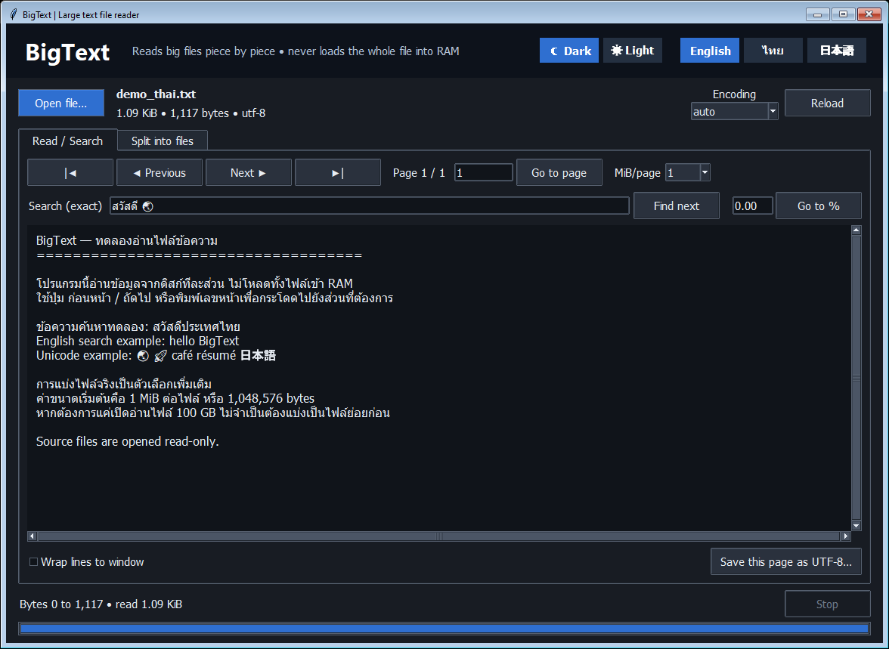

# BigText

A Windows reader and splitter for very large text files (100 GB and up). It reads one page at a time straight from disk, so the file is never loaded into RAM. Menus in English, Thai and Japanese, with dark and light themes.

คู่มือภาษาไทยฉบับเต็ม: [README_TH.md](README_TH.md)



## Features

- **Page through any file size**: pages are byte ranges (1/16 MiB to 4 MiB), so opening a 100 GB file does not scan it first. Jump by page number or percent.
- **Search**: exact text, forward from the current page, cancellable.
- **Split** into parts of a maximum size, ending at a line break when one is near the limit and never cutting a Unicode character in half. Parts are grouped 1,000 per folder with a manifest and SHA-256 per part.
- **Join** the parts back to a byte-identical copy of the original (checksums verified).
- **Encodings**: UTF-8/16/32 with BOM detection, cp874 (Thai), cp1252, Latin-1. The source file is always opened read-only.
- **Thai text drawn correctly**: Tk on Windows draws text in ~200-byte pieces, and a piece starting on a Thai vowel or tone mark shows a dotted circle. Long lines are tagged into runs that always start on a base character.
- **English / ไทย / 日本語 menus** and **dark / light themes**, switchable live from the header and remembered in `%APPDATA%\BigText\settings.json`.

## Requirements

Python 3.11 or newer with Tkinter (included in the python.org Windows installer). No other packages.

## Run

Double-click `Open_BigText.cmd`, or:

```powershell
py -3.11 bigtext.py gui
```

Command line (output is JSON):

```powershell
py -3.11 bigtext.py info   "D:\data\huge.txt"
py -3.11 bigtext.py page   "D:\data\huge.txt" --number 100 --size-mib 1 --out page100.txt
py -3.11 bigtext.py search "D:\data\huge.txt" "text to find"
py -3.11 bigtext.py split  "D:\data\huge.txt" --size-mib 1 --out "D:\data\parts"
py -3.11 bigtext.py join   "D:\data\parts" --out "D:\data\restored.txt"
```

## Tests

```powershell
py -3.11 -m unittest discover -s tests -v              # core, Thai draw runs, translations, theme contrast
py -3.11 verify_gui.py                                 # drives the real window, saves screenshots to reports\
py -3.11 verify_large_files.py --logical-gib 100 --real-mib 64
```

`verify_large_files.py` uses a sparse 100 GiB file for random access and tail search, plus a real 64 MiB file for a full search, split and join. It is not a throughput benchmark of a real 100 GiB file.

## Limits

- Search is literal text only (no regex), and there are no whole-file line numbers.
- The Thai dotted-circle fix covers the first 1,000 runs of each line (about 60,000 Thai characters); lower MiB/page for longer lines.
- Open/Save dialogs and message boxes are drawn by Windows and follow the system theme and language.
